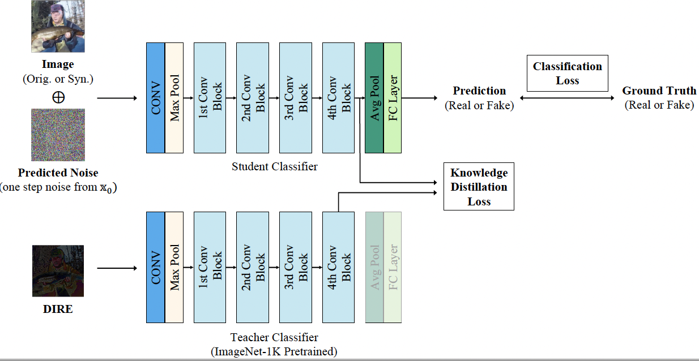

# Distil-DIRE
Distil-DIRE is a lightweight version of DIRE, which can be used for real-time applications. Instead of calculating DIRE image directly, Distl-DIRE aims to reconstruct the features of corresponding DIRE image forwared by a image-net pretrained classifier with one-step noise of DDIM inversion. 



### Train
For training Distil-DIRE, we only provide single gpu training script. 
```
python3 y1_train.py
```
 
You should prepare dataset in the following format:
```
mydataset/train/val/test
└── images
    ├── fakes
    │   └──img1.png...
    ├── reals
    │   └──rimg1.png...
└── eps
    ├── fakes
    │   └──img1.pt...
    ├── reals
    │   └──rimg1.pt...
└── dire
    ├── fakes
        └──img1.png...
    ├── reals
        └──rimg1.png...

```
For eps calculation, you can use the following script:
```
python3 y1_eps.py
```

## Deploy

Pretrained models are available in the following S3 paths.

| Model | S3 Model Path |
| --- | --- |
| ADM | s3://truemedia-dataset/256x256-adm.pt |
| Celeba-HQ DIRE| s3://truemedia-dataset/celebahq_sdv2.pth |
| ImageNet DIRE | s3://truemedia-dataset/imagenet_adm.pth |
| Distil-DIRE | s3://truemedia-dataset/y1distil-truemedia-240408-e19.pth |


### Test locally.
```
python -u -m server
curl -X GET http://localhost:8000/healthcheck
curl -X POST http://localhost:8000/predict \
    -H "Content-Type: application/json" \
    --data '{"file_path":"https://www.evalai.org/ocasio.mp4"}'

```
### with Docker 
```
export DOCKER_REGISTRY="miraflow" # Put your Docker Hub username here  
export DATE=`date +%Y%m%d` # Get the current date
# Build the Docker image for runtime
docker build -t "$DOCKER_REGISTRY/dire-yewon:rt-$DATE" -f Dockerfile-run .

# Build the Docker image for development
docker build -t "$DOCKER_REGISTRY/dire-yewon:dev-$DATE" -f Dockerfile-dev .


# Push your docker image to docker hub
docker login

docker push "$DOCKER_REGISTRY/dire-yewon:rt-$DATE"

docker push "$DOCKER_REGISTRY/dire-yewon:dev-$DATE"
```


Run this Docker image locally on a GPU to test that it can run inferences as expected:
```
docker run --gpus=all -d --rm -p 80:8000 --env SERVER_PORT=8000  --name "yewon-dire" "$DOCKER_REGISTRY/dire-yewon:rt-latest"

# Devl env 
export WORKDIR="~/Projects/yewon/"
docker run --gpus=all --name=yewon_gpu_all_dire -v "$WORKDIR:/workspace/" -ti -e  "$DOCKER_REGISTRY/yewon-dire:dev-latest"

# work inside the container (/workspace)
```

### Note
* This repo runs on ADM diffusion model (256x256, unconditional) trained on ImageNet 1k dataset and ResNet-50 deepfake classifier trained on ImageNet 1k dataset. 
* Minimum requirements: 1 GPU, 10GB VRAM
* Decision of transforms in model inference influences the model performance a lot. For low-latency, it is not recommended to use 5Crops or 10Crops.


map port 80 on your host to port 8000 in the Docker container. AWS only allows 80.

..and in a separate terminal run the following command one or more times

```
curl -X GET http://localhost:8000/healthcheck
```
until you see {"healthy":true}

```
curl -X POST http://localhost:8000/predict \
    -H "Content-Type: application/json" \
    --data '{"file_path":"https://www.evalai.org/ocasio.mp4"}'
```

sudo usermod -a -G docker ubuntu
allowing ubuntu user to execute Docker commands without needing superuser privileges. 

```
curl -X POST http://ec2-54-212-97-80.us-west-2.compute.amazonaws.com/predict \
    -H "Content-Type: application/json" \
    --data '{"file_path":"https://www.evalai.org/ocasio.mp4"}'
```


## Acknowledgments
Our code is developed based on [DIRE](https://github.com/ZhendongWang6/DIRE), [guided-diffusion](https://github.com/openai/guided-diffusion) and [CNNDetection](https://github.com/peterwang512/CNNDetection). Thanks for their sharing codes and models.

## Citation
If you find this work useful for your research, please cite our paper:
```
TODO: arxiv the paper
```
